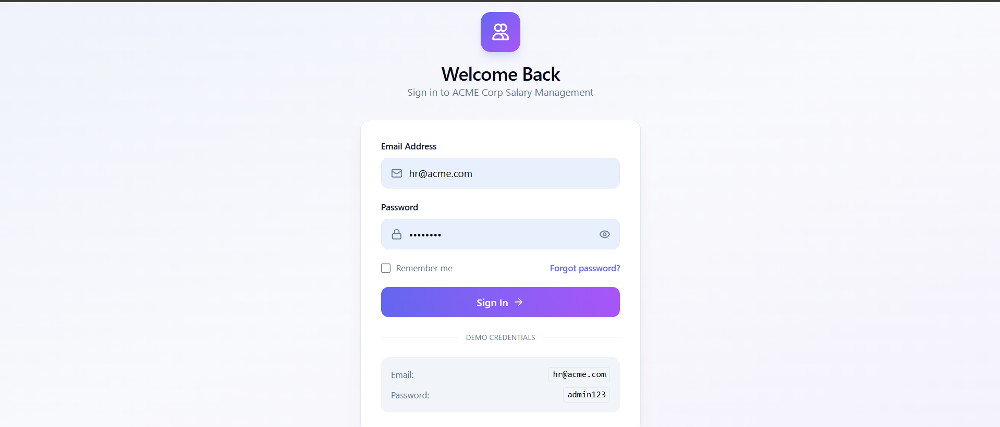
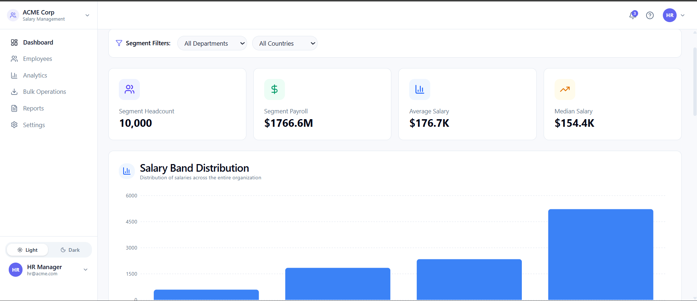
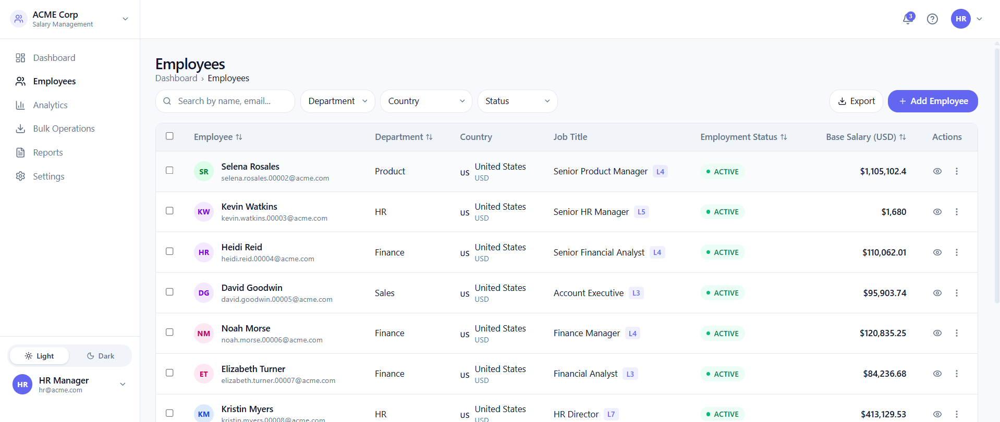
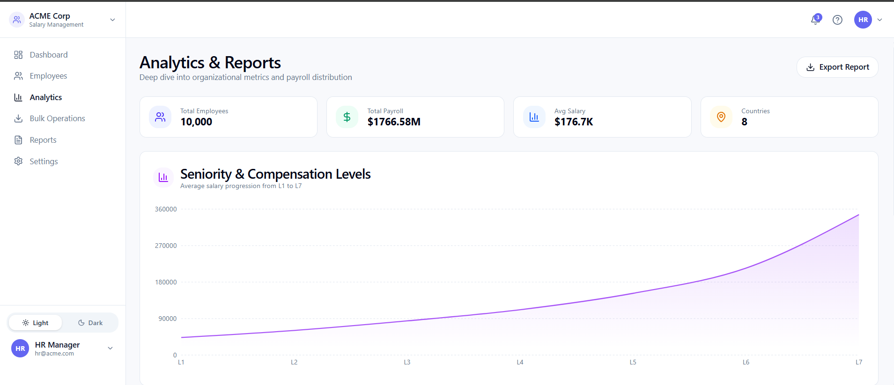

# ACME Corp - Employee Salary Management System

A production-grade web application for managing salary data for
**10,000+ employees** across multiple countries.

Built as a modern replacement for Excel-based HR workflows.

# Sample UI Screenshots

### Login


### Dashboard

*Interactive dashboard with department and country filters*

### Employee Management

*Manage 10,000+ employees with pagination and search*

### Analytics

*Deep-dive analytics with salary band distributions*

### Bulk Operations

*CSV-based bulk employee import and salary updates*

------------------------------------------------------------------------

# 🎯 Overview

This system enables HR Managers to:

-   Manage employee records and salary data at scale
-   Track salary history and audit compensation changes
-   Visualize payroll analytics across departments, countries, and job
    levels
-   Perform bulk operations using CSV import/export
-   View salaries in USD or convert to local currencies using live
    exchange rates
-   Switch between light and dark themes

------------------------------------------------------------------------

# 🛠️ Tech Stack

## Backend

  Component         Technology
  ----------------- -----------------------------------------
  Framework         FastAPI (Python 3.11+)
  Database          SQLite with async support (`aiosqlite`)
  ORM               SQLAlchemy 2.0 Async
  Architecture      Repository Pattern
  Authentication    JWT Tokens
  Validation        Pydantic v2
  Testing           pytest + pytest-asyncio + httpx
  Data Generation   Faker (10,000 employees)

------------------------------------------------------------------------

## Frontend

  Component       Technology
  --------------- -------------------
  Framework       React 18 + Vite
  Language        TypeScript
  Styling         Tailwind CSS v4
  UI Components   shadcn/ui
  Tables          TanStack Table v8
  Data Fetching   TanStack Query v5
  Routing         React Router v6
  Icons           Lucide React

------------------------------------------------------------------------

# 📁 Project Structure

    salary_management_code/

    ├── backend/
    │
    │── app/
    │   ├── main.py
    │   ├── config.py
    │   ├── database.py
    │
    │   ├── api/
    │   │   ├── deps.py
    │   │   └── routes/*
    │   ├── core/*
    │   ├── models/*
    │   ├── schemas/*
    │   ├── repositories/*
    │   └── services/*
    ├── tests/
    │   ├── conftest.py
    │   ├── test_employees.py
    │   ├── test_salaries.py
    │   └── test_bulk.py
    │
    ├── seed.py
    └── requirements.txt


    frontend/

    ├── src/
    │   ├── components/
    │   ├── pages/
    │   ├── hooks/
    │   ├── services/
    │   └── types/
    │
    ├── package.json
    └── vite.config.ts

------------------------------------------------------------------------

# 🚀 Quick Start

## Prerequisites

Install:

-   Python 3.11+
-   Node.js 18+
-   npm

------------------------------------------------------------------------

# Backend Setup

``` bash
cd backend

python -m venv venv

# Windows
venv\Scripts\activate

# Mac/Linux
source venv/bin/activate


pip install -r requirements.txt
```

Create `.env`

``` env
DATABASE_URL=sqlite+aiosqlite:///./acme_salary.db

SECRET_KEY=super_secret_key_change_this_in_production

ALGORITHM=HS256

ACCESS_TOKEN_EXPIRE_MINUTES=10080

DEBUG=True
```

Seed database:

``` bash
python seed.py
```

Start API:

``` bash
uvicorn app.main:app --reload --host 0.0.0.0 --port 8000
```

Access:

    API Docs:
    http://localhost:8000/docs


    Health Check:
    http://localhost:8000/health

------------------------------------------------------------------------

# Frontend Setup

``` bash
cd frontend

npm install

npm run dev
```

Application:

    http://localhost:5173

------------------------------------------------------------------------

# Default Credentials

    Email:
    hr@acme.com

    Password:
    admin123

------------------------------------------------------------------------

# 🧪 Running Tests

## Backend

``` bash
cd backend

pytest tests/ -v
```

Specific test:

``` bash
pytest tests/test_employees.py -v
```

Coverage:

``` bash
pip install pytest-cov

pytest tests/ --cov=app --cov-report=term-missing
```

------------------------------------------------------------------------

## Frontend Tests

``` bash
cd frontend

npm run test

npm run test:ui

npm run test:coverage
```

------------------------------------------------------------------------

# Core Functionality

## Employee Management

✅ Full CRUD operations

Features:

-   Search
-   Filtering
-   Sorting
-   Pagination

## Salary Management

✅ Salary updates

Includes:

-   Automatic salary history
-   Audit tracking

## Bulk Operations

✅ CSV import/export

Supports:

-   Employees
-   Salary updates

## Analytics Dashboard

Provides:

-   Payroll metrics
-   Department analysis
-   Country analysis
-   Salary level analysis

## Currency Conversion

Supports:

-   USD salaries
-   Local currency conversion
-   Live FX rates

## Authentication

Implemented:

-   JWT authentication
-   Secure login flow

------------------------------------------------------------------------

# UI / UX Features

## Theme Support

🌓 Light and dark mode

Stored using:

    localStorage

## Responsive Design

Supports:

-   Desktop
-   Tablet

## Data Tables

Powered by:

TanStack Table

Supports:

-   Server-side pagination
-   Large datasets

## Performance

Optimized using:

-   Async backend
-   Optimized database queries
-   Pagination

------------------------------------------------------------------------

# Development Commands

## Backend

Start server:

``` bash
uvicorn app.main:app --reload
```

Run seed:

``` bash
python seed.py
```

Install packages:

``` bash
pip install greenlet email-validator
```

------------------------------------------------------------------------

## Frontend

Development:

``` bash
npm run dev
```

Production build:

``` bash
npm run build
```

Preview:

``` bash
npm run preview
```

Lint:

``` bash
npm run lint
```

------------------------------------------------------------------------

# Summary

ACME Employee Salary Management System provides:

-   Scalable employee management
-   Salary audit tracking
-   Bulk processing
-   Payroll analytics
-   Secure authentication
-   Modern responsive UI

Designed with focus on:

-   Maintainability
-   Performance
-   Scalability
-   Clean architecture
